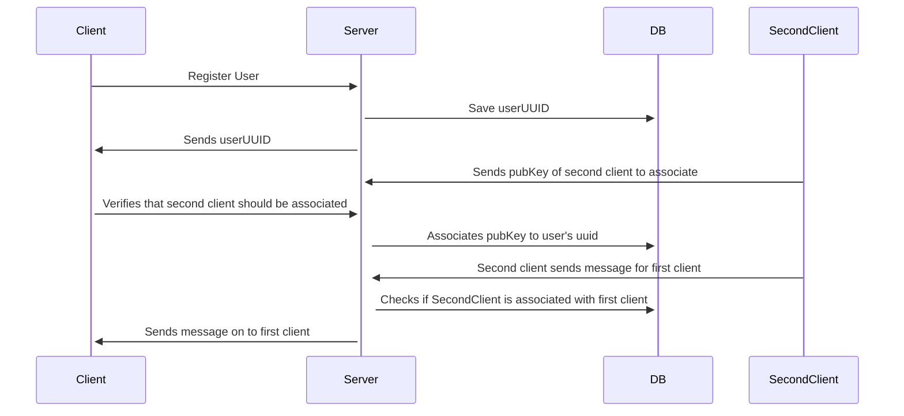
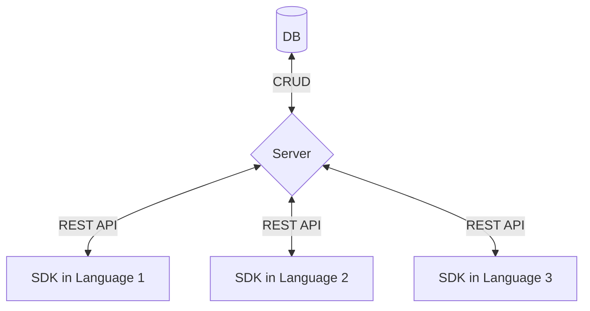

# Julia

*Julia* (named for early labor leader [Julia O'Connor][julia]) is a lightweight implementation of the [Sessionless][sessionless] authentication protocol, which allows implementers to associate keys with a user creating a sort of switchboard for Sessionless keys.

## Overview

Julia is composed of a CRUD server and database pair, and companion client-side libraries.
This repo defines the contract between client and server via REST API, provides database implementation(s) for storing the models used in that contract, and the methods necessary in a client implementation.

The typical usage will look something like:



And here's what the architecture looks like:



## API

It doesn't get much CRUDier than this API:

<details>
 <summary><code>PUT</code> <code><b>/user/create</b></code> <code>Creates a new user if pubKey does not exist, and returns existing uuid if it does.</code></summary>

##### Parameters

> | name         |  required     | data type               | description                                                           |
> |--------------|-----------|-------------------------|-----------------------------------------------------------------------|
> | pubKey       |  true     | string (hex)            | the publicKey of the user's keypair  |
> | timestamp    |  true     | string                  | in a production system timestamps narrow window for replay attacks  |
> | signature    |  true     | string (signature)      | the signature from sessionless for the message  |


##### Responses

> | http code     | content-type                      | response                                                            |
> |---------------|-----------------------------------|---------------------------------------------------------------------|
> | `200`         | `application/json`                | `{"userUUID": <uuid>}`   |
> | `400`         | `application/json`                | `{"code":"400","message":"Bad Request"}`                            |

##### Example cURL

> ```javascript
>  curl -X PUT -H "Content-Type: application/json" -d '{"pubKey": "key", "timestamp": "now", "signature": "sig"}' https://www.juliaswitch.com/user/create
> ```

</details>

<details>
 <summary><code>GET</code> <code><b>/user/:uuid?timestamp=<timestamp>&signature=<signature></b></code> <code>Returns a user's associated keys</code></summary>

##### Parameters

> | name         |  required     | data type               | description                                                           |
> |--------------|-----------|-------------------------|-----------------------------------------------------------------------|
> | timestamp    |  true     | string                  | in a production system timestamps prevent replay attacks  |
> | signature    |  true     | string (signature)      | the signature from sessionless for the message  |


##### Responses

> | http code     | content-type                      | response                                                            |
> |---------------|-----------------------------------|---------------------------------------------------------------------|
> | `200`         | `application/json`                | `{"keys": {"interactingKeys": [{"userUUID": <uuid>, "pubKey": <pubKey>}], "coordinatingKeys": []}`   |
> | `406`         | `application/json`                | `{"code":"406","message":"Not acceptable"}`                            |

##### Example cURL

> ```javascript
>  curl -X GET -H "Content-Type: application/json" https://www.juliaswitch.com/<uuid>?timestamp=123&signature=signature 
> ```

</details>

<details>
  <summary><code>POST</code> <code><b>/user/:uuid/associate/prompt</b></code> <code>Creates an association prompt</code></summary>

##### Parameters

> | name         |  required     | data type               | description                                                           |
> |--------------|-----------|-------------------------|-----------------------------------------------------------------------|
> | timestamp    |  true     | string                  | in a production system timestamps prevent replay attacks  |
> | signature    |  true     | string (signature)      | the signature from sessionless for the message  |


##### Responses

> | http code     | content-type                      | response                                                            |
> |---------------|-----------------------------------|---------------------------------------------------------------------|
> | `200`         | `application/json`                | `{prompt: <prompt>}`   |
> | `400`         | `application/json`                | `{"code":"400","message":"Bad Request"}`                            |

##### Example cURL

> ```javascript
>  curl -X POST -H "Content-Type: application/json" -d '{"timestamp": "right now", "newUUID": <uuid>, "newPubKey": <new pubKey>, "signature": "signature", "newSignature": <new signature>}' https://www.juliaswitch.com/user/<uuid>/associate
> ```

</details>

<details>
  <summary><code>POST</code> <code><b>/user/:uuid/associate</b></code> <code>Associates two users so they can message</code></summary>

##### Parameters

> | name         |  required     | data type               | description                                                           |
> |--------------|-----------|-------------------------|-----------------------------------------------------------------------|
> | timestamp    |  true     | string                  | in a production system timestamps prevent replay attacks  |
> | newUUID      |  true     | string                  | the uuid to associate
> | newPubKey    |  true     | string                  | the pubKey to associate
> | prompt       |  true     | string                  | the prompt for the association
> | signature    |  true     | string (signature)      | the signature from sessionless for the message  |
> | newSignature |  true     | string (signature)      | the signature from sessionless for the new key message  |


##### Responses

> | http code     | content-type                      | response                                                            |
> |---------------|-----------------------------------|---------------------------------------------------------------------|
> | `200`         | `application/json`                | `{ user }`   |
> | `400`         | `application/json`                | `{"code":"400","message":"Bad Request"}`                            |

##### Example cURL

> ```javascript
>  curl -X POST -H "Content-Type: application/json" -d '{"timestamp": "right now", "newUUID": <uuid>, "newPubKey": <new pubKey>, "prompt": <prompt>, "signature": "signature", "newSignature": <new signature>}' https://www.juliaswitch.com/user/<uuid>/associate
> ```

</details>

<details>
  <summary><code>DELETE</code> <code><b>/associated/:associatedUUID/user/:uuid</b></code> <code>Deletes a pubKey from the user</code></summary>

##### Parameters

> | name         |  required     | data type               | description                                                           |
> |--------------|-----------|-------------------------|-----------------------------------------------------------------------|
> | timestamp    |  true     | string                  | in a production system timestamps prevent replay attacks  |
> | signature    |  true     | string                  | the signature
  
##### Responses

> | http code     | content-type                      | response                                                            |
> |---------------|-----------------------------------|---------------------------------------------------------------------|
> | `200`         | `application/json`                | `{"deleted": true}`   |
> | `400`         | `application/json`                | `{"code":"400","message":"Bad Request"}`                            |

##### Example cURL

> ```javascript
>  curl -X DELETE https://www.juliaswitch.com/associated/<associated uuid>/user/<uuid>
> ```

</details>

<details>
  <summary><code>DELETE</code> <code><b>/user/:uuid</b></code> <code>Deletes a uuid and pubKey</code></summary>

##### Parameters

> | name         |  required     | data type               | description                                                           |
> |--------------|-----------|-------------------------|-----------------------------------------------------------------------|
> | timestamp    |  true     | string                  | in a production system timestamps prevent replay attacks  |
> | signature    |  true     | string                  | the signature
 
##### Responses

> | http code     | content-type                      | response                                                            |
> |---------------|-----------------------------------|---------------------------------------------------------------------|
> | `200`         | `application/json`                | `{"deleted": true}`   |
> | `400`         | `application/json`                | `{"code":"400","message":"Bad Request"}`                            |

##### Example cURL

> ```javascript
>  curl -X DELETE https://www.juliaswitch.com/<uuid>
> ```

</details>

### This is experimental. Use at your own risk

<details>
  <summary><code>POST</code> <code><b>/recover</b></code> <code>Initiates a recovery flow for a user. This works like associating a user in reverse.</code></summary>

##### Parameters

> | name         |  required     | data type               | description                                                           |
> |--------------|-----------|-------------------------|-----------------------------------------------------------------------|
> | timestamp    |  true     | string                  | in a production system timestamps prevent replay attacks  |
> | newUUID      |  true     | string                  | the uuid to associate
> | newPubKey    |  true     | string                  | the pubKey to associate
> | signature    |  true     | string (signature)      | the signature from sessionless for the message  |
> | newSignature |  true     | string (signature)      | the signature from sessionless for the new key message  |


##### Responses

> | http code     | content-type                      | response                                                            |
> |---------------|-----------------------------------|---------------------------------------------------------------------|
> | `200`         | `application/json`                | `{keys: [...keys]}`   |
> | `400`         | `application/json`                | `{"code":"400","message":"Bad Request"}`                            |

##### Example cURL

> ```javascript
>  curl -X POST -H "Content-Type: application/json" -d '{"timestamp": "right now", "newUUID": <uuid>, "newPubKey": <new pubKey>, "signature": "signature", "newSignature": <new signature>}' https://www.juliaswitch.com/recover
> ```

</details>


### The following are temporarily part of Julia and may move to another repo at some point.

<details>
  <summary><code>POST</code> <code><b>/message</b></code> <code>Posts a message</code></summary>

##### Parameters

> | name         |  required     | data type               | description                                                           |
> |--------------|-----------|-------------------------|-----------------------------------------------------------------------|
> | timestamp    |  true     | string                  | in a production system timestamps narrow the risk of replay attacks  |
> | senderUUID   |  true     | string                  | the sender's uuid
> | receiverUUID |  true     | string                  | the receiver's uuid
> | content      |  true     | string                  | the content to post  |
> | signature    |  true     | string (signature)      | the signature from sessionless for the message  |


##### Responses

> | http code     | content-type                      | response                                                            |
> |---------------|-----------------------------------|---------------------------------------------------------------------|
> | `200`         | `application/json`                | `{success: true}`   |
> | `400`         | `application/json`                | `{"code":"400","message":"Bad Request"}`                            |

##### Example cURL

> ```javascript
>  curl -X POST -H "Content-Type: application/json" -d '{"timestamp": "right now", "senderUUID": <uuid>, "receiverUUID": <uuid>, "message": <message>, "signature": "signature"}' https://www.juliaswitch.com/message
> ```

</details>

<details>
 <summary><code>GET</code> <code><b>/messages/user/:uuid?timestamp=<timestamp>&signature=<signature></b></code> <code>Returns a user's associated keys</code></summary>

##### Parameters

> | name         |  required     | data type               | description                                                           |
> |--------------|-----------|-------------------------|-----------------------------------------------------------------------|
> | timestamp    |  true     | string                  | in a production system timestamps narrows the risk of replay attacks  |
> | uuid         |  true     | string                  | the user's uuid  |
> | signature    |  true     | string (signature)      | the signature from sessionless for the message  |


##### Responses

> | http code     | content-type                      | response                                                            |
> |---------------|-----------------------------------|---------------------------------------------------------------------|
> | `200`         | `application/json`                | `{"keys": [{"userUUID": <uuid>, "pubKey": <pubKey>}]`   |
> | `406`         | `application/json`                | `{"code":"406","message":"Not acceptable"}`                            |

##### Example cURL

> ```javascript
>  curl -X GET -H "Content-Type: application/json" https://www.juliaswitch.com/messages?uuid=<uuid>timestamp=123&signature=signature
> ```

</details>

## Databases

One of the biggest benefits of Sessionless is that it doesn't need to store any sensitive data.
This means all of the data Julia cares about can all be saved in a single table/collection/whatever-other-construct-some-database-may-have.
And that table looks like:

| uuid  | pubKey | keys
:-------|:-------|:-----
 string | string | {uuid, key}[]

### The following may be temporary to Julia

And for messages it looks like:

| uuid  | timestamp | content
:-------|:-------|:-----
 string | string | string

uuid, and pubKey should have unique constraints (Sessionless generated keys and uuids should not collide, but since this is a public API people may just reuse keys and uuids).

## Client SDKs

Client SDKs need to generate keys via Sessionless, and implement the networking to interface with the server. 
To do so they should implement the following methods:

`checkForUser()` - Checks if keys have been generated, and a uuid exists (all of these should be stored in secure storage of the client)--this is the Sessionless check for if a user is logged in.

`createUser()` - Should generate keys, save them appropriately client side, and PUT to /user/create.

`syncKeys()` - Syncs associated keys with the server

`deleteKey()` - Deletes an associated key

`deleteUser(uuid)` - Should DELETE a user by calling /user/:uuid.


## Use cases

**NOTE** Julia is experimental, and the instance at juliaswitch.com is ephemeral, and may go away or reset at any time.
If you're making the next WhatsApp and want to use juliaswitch, you're advised to self-host it, or contact zach@planetnine.app to help him upgrade the micro instance it runs on :).

* Any time you have a need for friends, contacts, or users associating, you can use Julia

* Any sort of messaging you want to do [see Julia messenger][julia messenger]

* You can use continuebee for account continuity before using more intrusive auth layers.
I.e. instead of having potential players bounce off because of needing to enter their email/password before playing, you can auth with continuebee, and then ask for email/password when they hit level five after they've been hooked.

* Just use it as a practice backend before figuring out all the auth needs of your game/app. 

## Self-hosting

This is a bit dependent on what the server implementations are, so we'll fill the details in later, but the idea is that continuebee is hostable by others either for public use like the main instance, or private use.

## Contributing

To add to this repo, feel free to make a [pull request][pr].

[julia]: https://en.wikipedia.org/wiki/Julia_O'Connor
[julia messenger]: https://app.juliaswitch.com
[sessionless]: https://www.github.com/planet-nine-app/sessionless

